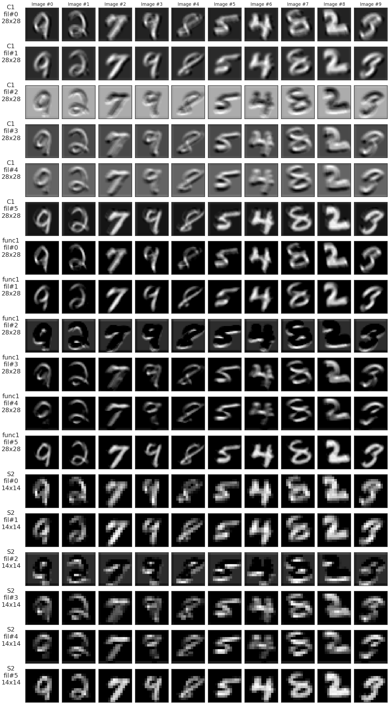

# 💻 Projetos de Sistemas baseados em Aprendizado de Máquina 

## Projeto 2: Visualização das Camadas da CNN: Um Estudo de Caso
<p align="center">
  <a href="#">
    
  </a>
</p>

### 🏃 Componentes
1. Paula Souza
2. Ítalo Maciel

### 📌 Descrição do projeto
<p align="justify">
O Trabalho da Unidade 02 é um Estudo de Caso que visa a Visualização das Camadas da CNN (Rede Neural Convolucional).
</p>
<p align="justify">
O projeto exige a manipulação de componentes específicos, mantendo a arquitetura-base (LeNet-like) como visto em aula, adaptando apenas in_channels se necessário.
</p>
<p align="justify">
A tarefa principal é aplicar a predição da arquitetura da CNN sobre essas imagens,culminando na visualização gráfica de imagens e seus rótulos correspondentes.
</p>
<p align="justify">
O estudo está inserido no contexto da exploração de CNNs com PyTorch e deve ser entregue até o dia 23 de novembro de 2025 (23h59).
</p>

### ▶️ Instruções para executar o código
<p align="justify">

1. Clone o repositório utilizando o seguinte comando git na sua máquina.

``` git clone https://github.com/italomacielp/classification_with_pytorch```

2. Realize o upload no colab notebook. Acessando o menu do colab e seguir o seguinte fluxo: <u>Arquivo → Fazer Upload de Arquivo.</u>

3. Execute todas as células com a opção: *Executar tudo*.
</p>

### 🚧 Arquitetura
<p align="justify">
A classe Architecture serve como um contêiner completo para treinamento, validação, análise e visualização de modelos em PyTorch. 
</p>
<p align="justify">
Ela recebe o modelo, a função de perda e o otimizador, configurando automaticamente o dispositivo (CPU/GPU) e gerenciando loaders de treino e validação. A classe cria funções internas de train step e validation step, que executam o forward, calculam a perda, fazem o backward e atualizam os pesos quando necessário, também controla todo o loop de treinamento, armazenando perdas, épocas e permitindo salvar e carregar checkpoints. 
</p>
<p align="justify">
Além disso, oferece métodos para prever novos dados, contar parâmetros, visualizar filtros de camadas convolucionais, registrar hooks para capturar ativações internas e plotar curvas de perda. Por fim, inclui funções utilitárias como definição de semente, avaliação de acurácia por classe e aplicação de operações ao longo dos loaders.
</p>

### 📁  Base de Dados
<p align="justify">
Nesse trabalho estamos analisando o conjunto de dados MNIST. Esse banco de imagens é um dos mais utilizados em estudos e experimentos envolvendo reconhecimento de padrões, 
servindo como uma base ideal para observar o desempenho de modelos de visão computacional em tarefas simples de classificação.
</p>
<p align="justify">
O MNIST reúne 60.000 imagens em tons de cinza cada uma com resolução 28×28 pixels, contendo registros de dígitos manuscritos.
</p>
<p align="justify">
Esses exemplos estão organizados em 10 categorias, representando os números de 0 a 9. 
Essa estrutura compacta e padronizada facilita a compreensão dos primeiros passos na construção e treinamento de modelos convolucionais.
</p>

### 🚋 Estrutura da arquitetura base (Modelo LeNet-like)
<p align="justify">
A arquitetura segue uma estrutura padrão do modelo LeNet contendo blocos de *featurizer* e *classifier*, que correspondem captura de atributos e classificação dos dados. Os blocos contidos na camada de captura de atributos é constituida por:
</p>

- Entrada (Input): Recebe a imagem em sua dimensionalidade real e distribui os pixels para a rede neural, nesse caso foi utilizada a base de dados MNIST que possui imagens 28x28 e somente 1 canal. 
- Convoluções (Conv2D): Tem como função extrair características importantes da imagem, a partir da aplicação de filtros (kernels) na imagem. Cada filtro pode detectar padrões, como:
1. Bordas
2. Texturas
3. Curvas
4. Traços
- Redução de dimensionalidade (Pooling): Reduz o mapa de características, com objetivo de resumir a imagem mantendo as informações mais importantes dela para o processo de classificação, servindo também para evitar *overfitting*.
- Achatamento (Flatten): Achata as saídas 2D para um vetor 1D, importante para encarregar esses dados nas camadas profundas.
Os blocos contidos na camada de classificação é constituida por:
- Camada densa (FC): Que realiza a combinação das características detectadas, e aprende as relações complexas entre as características.
- Saída: Possui uma classe por neurônio de saída, convertendo os valores em probabilidades. Com o objetivo geral de decisão de qual classe a imagem pertence.

<p align="justify">

**Observação**: Foram adicionadas camadas de *dropout* antes da saída. Esse tipo de camada é útil reduzir o overfitting, desligando neurônios durante o treinamento realizando uma distribuição melhor dos dados.
</p>

### 📊 Explicação dos seus resultados e observações
#### Curvas de treinamento e validação
<p align="center">
  <a href="#">
    
  </a>
</p>

<p align="justify">
Com base na curva apresentada para o modelo sem ajustes e configurado para 20 épocas de treinamento, observa-se um comportamento de overfitting. Isso indica que o modelo passa a memorizar os dados de treinamento, reduzindo sua capacidade de generalização e prejudicando o desempenho nas predições sobre novos dados.
</p>

<p align="center">
  <a href="#">
    
  </a>
</p>

<p align="justify">
Com a aplicação da camada de dropout, observa-se uma melhora significativa na aproximação entre as curvas de treinamento e validação, mantendo a mesma quantidade de épocas. Nesse caso, foi utilizado um dropout de 50%, o que significa que metade dos neurônios é desativada aleatoriamente durante o treinamento, reduzindo o risco de overfitting. Ainda assim, é possível aprimorar o modelo com ajustes adicionais.
</p>

<p align="center">
  <a href="#">
    
  </a>
</p>

<p align="justify">
Na última curva, aumentou-se a quantidade de épocas e reduziu-se a taxa de dropout utilizada na camada oculta. Mesmo com essas alterações, o modelo manteve um bom desempenho, mostrando curvas de treinamento e validação mais próximas. Com um número maior de épocas, a tendência de aproximação se torna mais evidente, indicando um comportamento mais estável e consistente do modelo.
</p>

#### Matriz de confusão
<p align="center">
  <a href="#">
    
  </a>
</p>

<p align="justify">
Pela matriz de confusão apresentada, observa-se que o modelo apresenta um desempenho considerado excelente. Isso ocorre porque a maior parte das previsões corretas se concentra na diagonal principal, indicando alta taxa de acerto ao identificar corretamente cada classe.
</p>

#### Mapa de características

<p align="center">
  <a href="#">
    
  </a>
</p>

<p align="justify">
O mapa de características apresentado permite visualizar e depurar as transformações que a imagem de entrada sofre nas camadas subsequentes, evidenciando quais padrões são extraídos e quais regiões se tornam mais relevantes para o modelo.
</p>

### 🎥 Link para o vídeo da sua apresentação


### ✅ Checklist de Entrega

| Item | Descrição | Status |
|------|--------------|--------|
| Dataset | Escolher um dataset do torchvision.datasets | ✅ |
| Arquitetura | Manter a arquitetura-base (LeNet-like) como visto em aula, adaptando apenas in_channels se necessário. | ✅|
| Loss Functions/Métricas | Treinar o modelo e registrar métricas de loss e accuracy (treino/val) | ✅ |
| Hooks | Implementar Hooks para capturar ativações intermediárias. | ✅ |
| Visualização | Visualizar os feature maps de todas camadas. | ✅ |
| Análise | Escrever uma breve análise (1-2 parágrafos) sobre o que foi observado. | ✅ |
| Video | Gravar um vídeo de até 10min sobre o que foi observado. | ☐ |
| Repositório | Organizar um repositório no Github com tudo o que foi desenvolvido, incluindo um arquivo README.md descrevendo todo trabalho em detalhes. | ✅ |
---